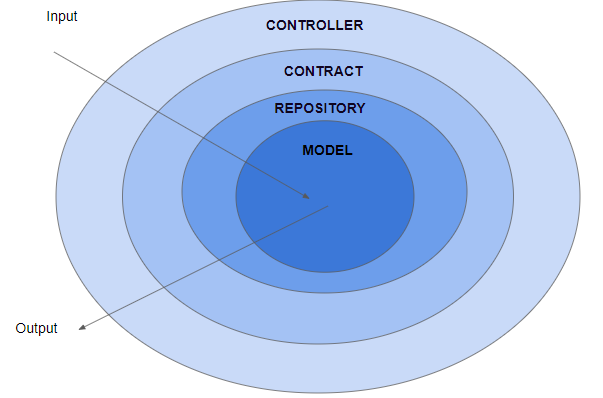
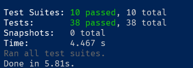

# Banking API

This is a simple REST API to do some bankings operations such as create an account, deposit, withdraw, transfer from one account to another and get the balance of an account. In the future this can have new features and operations.

You can install on you computer the application and run, or you can access the production version on the cloud, <b>https://my-banking-api.herokuapp.com/</b>.  

## Configuration

To run this API in your local machine you have to do the following procedures and commands:

1. Make sure you have installed on your machine the following softwares:

* <b>NodeJS</b>: The runtime that is going to create a local server and run your applications;
* <b>Yarn</b>: The package manager for Node, if depending on your node version, it can already come installed with node;
* <b>Make</b>: Is used to automate tasks and commands on your application, reducing the number of the commands you are going to make. If you are using an UNIX-like OS it's already installed. For Windows users, you can install it using chocolately;

2. Create a ```.env``` file on the root directory, containing the variables and values like on the example file, ```.env-example```.

This file is for use enviroment variables on your application, passing some informations that can change from one enviroment to another. Used to store sensitive data.

The variables used on this application are:

* <b>DATABASE_TYPE</b>: The type of the database the application is going to use to store the data, the value <b>must</b> be one of the values avaliable on the enumerator class <b>DatabaseType.ts</b> on the <b>config</b> module. At the moment, the only value avaliable is <b>1</b>, meaning that all the data is stored localy on the runtime application memory.

3. Run the command for install all the dependencies of this application needs:

With the make command:

```bash
make install
```

or with yarn:

```bash
yarn
```

4. And now you can run the application:

<b>RUN ON DEV MODE</b> This running mode is with hot reload, if you change some part of the source code of the application, you do not need to stop the application and start again, is going to do this automatically.

Make:

```bash
make run-dev
```

or with yarn:

```bash
yarn start:dev
```

<b>RUN ON PROD MODE</b> This is going to transpile to JS all your source code and put on a directory called <i>dist</i> on the root and run your application by this generated source code.

Make:

```bash
make run-prod
```

or with yarn:

```bash
yarn start
```

That's it you are ready to go 🚀🚀🚀

## Architeture

The software was built using the clean architeture principles. Resulting in a application with low coupling and resilient. 

The application is separated in modules, each one doing some functionality and independent of each other. This helps for future grow of the project and new implementations without need of rewrite the whole application.

In the following is an ilustrated represention of how the geeral architeture works in this application:



On the input, the application start on the most external layer and goes to the most internal one. And as the response goes to the opposite direction, returning to where it started.

Here is some information about the modules on this application:

* <b>config</b>: Where is loaded all the enviroment variables on the ```.env``` file;
* <b>contract</b>: Contain some interfaces used as data types that flows the data between the modules. This strategy is used to prevent circular dependencies on the modules. And to format the data for the presentation for the user;
* <b>controller</b>: Responsible to input the commands of the user and output the responses information;
* <b>log</b>: Classes used to create the logs on the application, to inform errors and issues on the application;
* <b>server</b>: Module to setup the server and register all the routes and others configurations;
* <b>model</b>: The entities of the application, when all the business rules are managed;
* <b>repository</b>: Where is stored the data and all the persistances operations are made.

The application was built using the best practices and methodologies of the software development. This helps to reduce the coupling and makes the application more resilient.

Some design patterns used on this application:

* <b>Singleton</b>: On the class <b>RepositorySingleton</b> on the <i>repository</i> module, is used to ensure that the database is going to have just one instance. This is required by the fact that the data is stored on the application memory, so if there's more than one instance of the object, the data is not going to be centralized.

* <b>Abstract Factory</b>: On the class <b>RepositoryFactory</b> on the <i>repository</i> module, is where creates an instance of the object that is going to do data manipulation. With this design pattern, you can easily change between databases and have more than one way to store the data, without have to rewrite the whole application.

## Tests

The application was made using the TDD (Test Drive Development) approach, testing each functionality and situation competly isolated of the rest, all the logic was built starting by the tests. This helps the development be more centered on building a solid logic of the application and after manage how it flows.

The tests coverage a total of <b>99%</b> of the functionalities of the application. Coveraging all the situations and the logics possible to this implementation. 

You can run the tests with the following command:

Make version:

```bash
make tests
```

Yarn version:
```bash
yarn test
```
The output of the test is going to be like this:



The use of tests is very important on the now-a-days software development, because with them when you make changes on the code, you are going to be a warranty if this will break some other logic or not.

## Endpoints and requests

In this section is where is listed all the avaliables endpoints, and its parameters and returns.

>Note:
: The ROOT_URL is tha base url of the application running, if you are running on development, locally use <b>localhost:3000</b> and production <b>https://my-banking-api.herokuapp.com</b>

### Reset state

This a POST endpoint is for cleanup the data stored on the memory/database and be empty of data. This endpoint doesn't need a body.

<b>Endpoint</b>: ROOT_URL/reset

If the request was successfully done, is going to return a 200 status code with the following body:

```json
OK
```

### Get Balance

This is a GET endpoint whose retrieves the balance of an account specified on the parameter on the url.

<b>Endpoint</b>: ROOT_URL/balance?account_id=100

You must specify the number of the account on the <b>account_id</b> variable. <b>MUST</b> be with this parameter name and needs to be specified one.

If the request was sucessfull is going to return a 200 status code with the following body, that is the balance amount of this account:

```json
100
```

Otherwise, if the request failes, not find the corresponding account is going to return a 404 status code with the following body:

```json
0
```

### Do an Event

This is a POST endpoint, used to do some of this operations:

* Deposit
* Withdraw
* Transfer

<b>Endpoint</b>: ROOT_URL/event

><b>Note</b>:
>All this operations uses the same endpoint, what changes from one to another is the request body.

#### Depoist

Here is for deposit some amount to an account, if the account doesn't exist, it is going to be created with this amount as initial balance.

The body of this request is:

```json
{
	"type":"deposit", 
	"destination":"200", 
	"amount":10
}
```

And the response is going to be a 201 with the following response body:

```json
{
	"destination": {
		"id": "200",
		"balance": 20
	}
}
```

#### Withdraw

Is used for doing a withdraw from an account, retrieve some amount from the balance of the account:

The body of this request is:

```json
{
	"type":"withdraw", 
	"origin":"200", 
	"amount":10
}
```

And the response is going to be a 201 with the following response body:

```json
{
	"origin": {
		"id": "200",
		"balance": 0
	}
}
```

If the response fails, if the account doesn't exist, is going to return a 404 status code with the following body:

```json
0
```

#### Transfer

This action is for send some amount from one account to another. Is not required that both accounts already exist, only the origin account must exist. If the destination account doesn't exist, is going to be created.


The body of this request is:

```json
{
	"type":"transfer", 
	"origin":"100", 
	"amount":40, 
	"destination":"200"
}
```

And the response is going to be a 201 with the following response body:

```json
{
	"origin": {
		"id": "100",
		"balance": 60
	},
	"destination": {
		"id": "200",
		"balance": 60
	}
}
```

If the response fails, the origin account does not exist, if the account doesn't exist, is going to return a 404 status code with the following body:

```json
0
```


